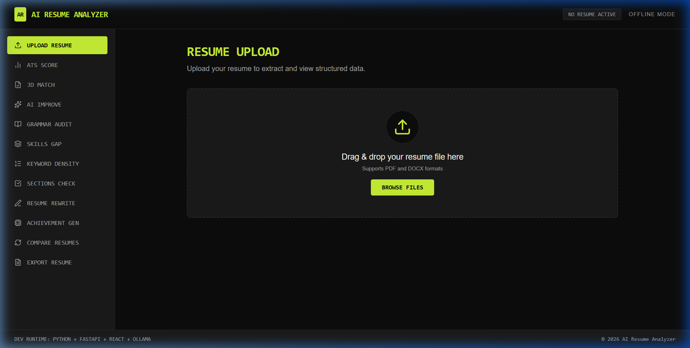

# AI Resume Analyzer

An offline AI-powered resume analysis and improvement application featuring ATS scoring, job description matching, skills gap analysis, inline grammar auditing, and custom style rewrites.

## Features

- **Resume Upload & Parsing**: Text extraction from PDF (PyMuPDF) and DOCX (python-docx) files.
- **ATS Scoring Engine**: Breakdown scoring of keywords, experience, projects, skills, education, formatting, and achievements.
- **Job Description Matcher**: Cosine similarity match using `sentence-transformers` (`all-MiniLM-L6-v2`).
- **AI Suggestions & Rewrites**: Offline LLM rewriting via Ollama (`qwen2.5:1.5b`).
- **Skills Gap & Density Analysis**: Custom extraction of missing and present skills.
- **Resume Comparison**: Side-by-side comparison of two resumes (V1 vs V2).
- **Missing Sections Detector**: Integrity check and structural auditing.
- **PDF/DOCX/Markdown Export**: Multi-format resume downloading.

## Tech Stack

- **Frontend**: React, TypeScript, Tailwind CSS, Recharts, Axios
- **Backend**: FastAPI, PyMuPDF, python-docx, spaCy, sentence-transformers, SQLite, ChromaDB
- **Offline AI**: Ollama (`qwen2.5:1.5b`)

---

## Setup & Running Local Services

### Prerequisite: Ollama
For offline LLM support, ensure Ollama is installed and the model is loaded on your host machine:

```bash
# Pull the required offline model
ollama pull qwen2.5:1.5b
```

### Running with Docker Compose

To start the frontend, backend, and Ollama services:

```bash
docker-compose up --build
```

- **Frontend**: [http://localhost:3000](http://localhost:3000)
- **Backend API**: [http://localhost:8000](http://localhost:8000)
- **Ollama**: [http://localhost:11434](http://localhost:11434)

### Running Locally without Docker

#### Backend Setup
1. Navigate to the backend directory:
   ```bash
   cd backend
   ```
2. Create and activate a virtual environment:
   ```bash
   python -m venv venv
   # On Windows:
   venv\Scripts\activate
   # On macOS/Linux:
   source venv/bin/activate
   ```
3. Install dependencies:
   ```bash
   pip install -r requirements.txt
   python -m spacy download en_core_web_sm
   ```
4. Start the backend:
   ```bash
   python main.py
   ```

#### Frontend Setup
1. Navigate to the frontend directory:
   ```bash
   cd frontend
   ```
2. Install dependencies:
   ```bash
   npm install
   ```
3. Start the dev server:
   ```bash
   npm run dev
   ```

---

## Environment Variables

### Backend Environment Variables
- `OLLAMA_HOST`: The URL of the Ollama server (defaults to `http://localhost:11434` or `http://ollama:11434` in Docker).
- `DATABASE_PATH`: SQLite database path (defaults to `backend/app/db/resume.db`).
- `UPLOAD_DIR`: Direct storage directory for uploaded resumes (defaults to `backend/uploads/`).

### Frontend Environment Variables
- `VITE_API_URL`: Backend API URL (defaults to `http://localhost:8000`).


